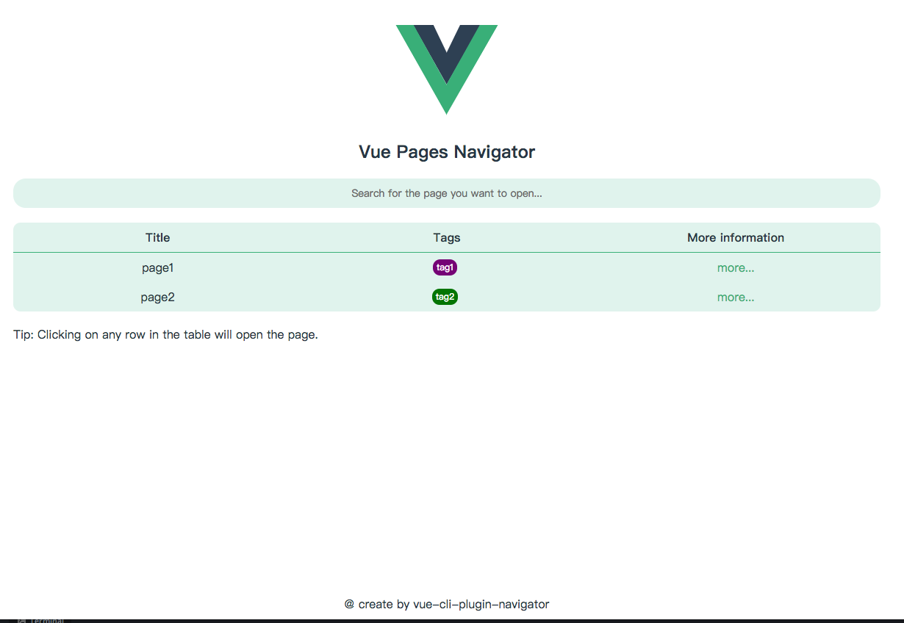
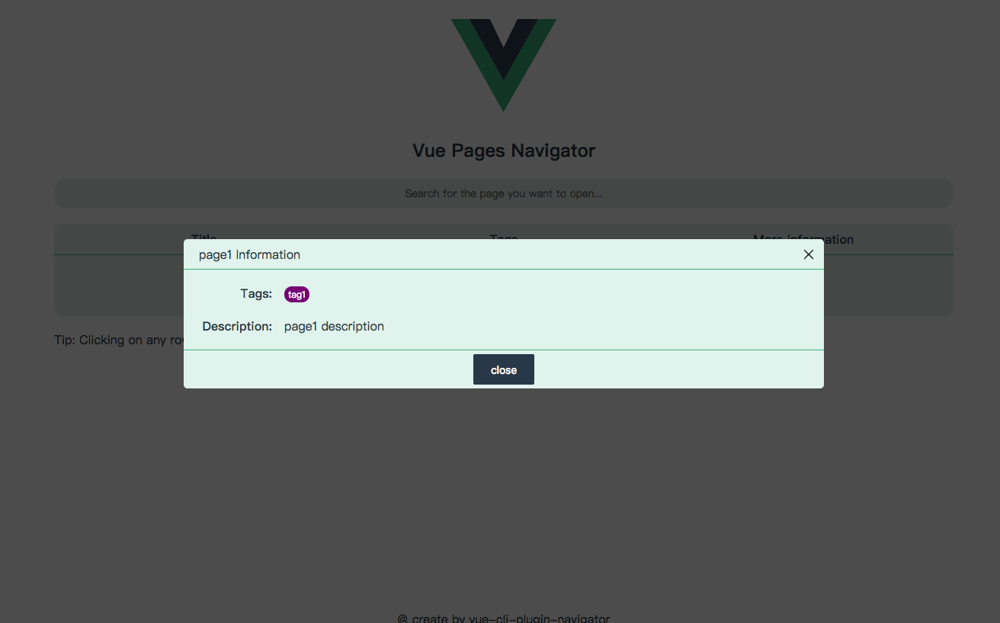
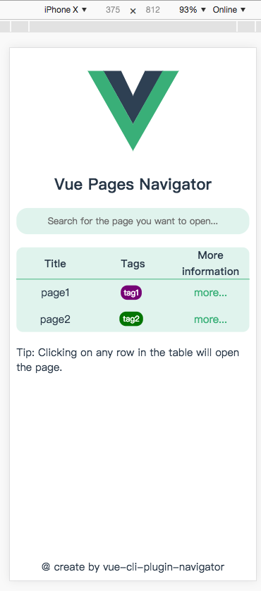
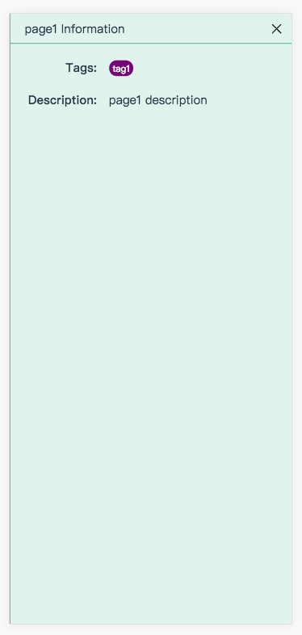

# vue-cli-plugin-navigator

[](https://travis-ci.org/longshihui/vue-cli-plugin-navigator) [](https://www.npmjs.com/package/vue-cli-plugin-navigator) [](https://www.npmjs.com/package/vue-cli-plugin-navigator) [](https://www.npmjs.com/package/vue-cli-plugin-navigator)

Page navigation in a **vue-cli 3** multi-page development.

This plugin will provide a homepage.

On the plugin's home page, it lists the pages you defined in vue.config.js. You can select a page that you want to open.

[中文文档](./README_zh.md)

## Usage

**vue cli**

```
vue add navigator
```

**yarn**

```
yarn add vue-cli-plugin-navigator --dev
```

**npm**

```
npm i vue-cli-plugin-navigator --save-dev
```

## Configuration

The namespace of the plugin configuration is **navigator**.

This plugin has two personalized configurations,

Help you find your page better on the plugin homepage.

You can now assign tags and descriptions to your pages as you configure them.

See [this file](./lib/OptionsDefaulter.js) for config options.

example:

**vue.config.js**

```
{
   ...other config
   pages: {
      page1: {
         entry: './src/page1.js',
         title: 'page1',
         filename: 'page1.html'
      },
      page2: './src/page2.js'
   },
   pluginOptions: {
      navigator: {
         // The title configured here will be displayed on the title of the home page.
         title: 'welcome'
         // Define your tags
         // Type is Tag[]
         // Tag typedef is
         // {
         //    name: string,
         //    color: string,
         // }
         defineTags: [
            {
               name: 'tag1',
               color: 'purple'
            },
            {
               name: 'tag2',
               color: 'green'
            }
         ],
         // If a page does not have specific configuration
         // its configuration will be the same as the secondary configuration.
         defaults: {
            tags: [],
            description: 'none'
         }
         pages: {
             page1: {
                 tags: ['tag1'],  // This is the tags of the page, type is string[].
                 description: 'page1 description'  // This is the description of the page, type is string
             }
         }
      }
   }
}
```

## Example

If you have a vue.config.js file configured as follows

```
{
   pages: {
      page1: './src/page1.js',
      page2: './src/page2.js'
   },
   pluginOptions: {
      navigator: {
         title: 'Hello world'
         defineTags: [
            {
               name: 'tag1',
               color: 'purple'
            },
            {
               name: 'tag2',
               color: 'green'
            }
         ],
         defaults: {
            tags: ['tag2'],
            description: 'none'
         }
         pages: {
             page1: {
                 tags: ['tag1'],
                 description: 'page1 description'
             }
         }
      }
   }
}
```

Run your project on dev mode

Here is a screenshot of the plugin.

**on PC**




**on Mobile**



